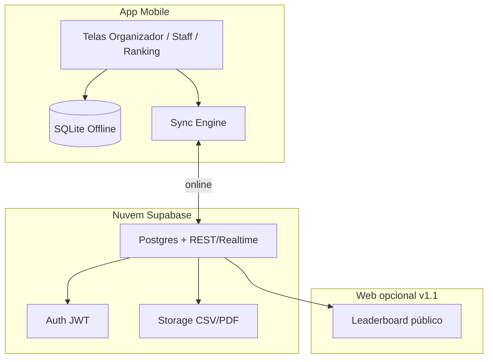

# Plano do App Hyrox — Competições, Cronometragem e Ranking

> **Objetivo:** Aplicativo mobile (Google Play + Apple App Store) para organizadores e staff cronometrarem competições no formato Hyrox, com cadastro de eventos, atletas, estações/exercícios e ranking por categoria.

---

## 1. Visão do produto

### Problema
Organizadores de eventos Hyrox (academias, boxes, provas locais ou regionais) precisam registrar atletas, acompanhar o tempo em cada estação e publicar rankings — muitas vezes com planilhas, cronômetros manuais e consolidação lenta.

### Solução
Um app **offline-first** com sincronização em nuvem que permite:

| Papel | O que faz |
|-------|-----------|
| **Organizador** | Cria evento, define categorias, importa atletas, configura estações |
| **Staff / Juiz** | Inicia/para cronômetro por atleta e por estação, aplica penalidades |
| **Atleta / Público** | Consulta ranking ao vivo e resultado final por categoria |

### Formato Hyrox (referência de domínio)

Sequência fixa em toda prova oficial:

| # | Tipo | Estação / Corrida | Prescrição padrão |
|---|------|-------------------|-------------------|
| 1 | Corrida | Run 1 | 1 km |
| 2 | Estação | SkiErg | 1.000 m |
| 3 | Corrida | Run 2 | 1 km |
| 4 | Estação | Sled Push | 50 m |
| 5 | Corrida | Run 3 | 1 km |
| 6 | Estação | Sled Pull | 50 m |
| 7 | Corrida | Run 4 | 1 km |
| 8 | Estação | Burpee Broad Jumps | 80 m |
| 9 | Corrida | Run 5 | 1 km |
| 10 | Estação | Rowing | 1.000 m |
| 11 | Corrida | Run 6 | 1 km |
| 12 | Estação | Farmers Carry | 200 m |
| 13 | Corrida | Run 7 | 1 km |
| 14 | Estação | Sandbag Lunges | 100 m |
| 15 | Corrida | Run 8 | 1 km |
| 16 | Estação | Wall Balls | 100 reps |

**Total:** 8 km de corrida + 8 estações de trabalho.

**Categorias típicas:** Open, Pro, Doubles (M/F/Mixed), Relay — com pesos/reps diferentes por divisão e gênero.

**Roxzone:** tempo de transição entre corrida e estação (opcional no MVP; recomendado na v1.1).

---

## 2. Requisitos funcionais (mapeamento solicitado)

### 2.1 Cadastrar o evento

**Campos mínimos:**
- Nome, data, local, fuso horário
- Tipo: Singles / Doubles / Relay / Misto (evento com várias divisões)
- Status: rascunho → inscrições abertas → em andamento → encerrado
- Template de prova: **Hyrox padrão 16 segmentos** (pré-carregado) ou customizado
- Ondas (waves) de largada por categoria
- Regras de penalidade (ex.: +2 min saída errada da estação)

**Telas:**
- Lista de eventos
- Criar/editar evento
- Dashboard do evento (atletas inscritos, provas em curso, ranking)

---

### 2.2 Cadastrar os atletas

**Por atleta:**
- Nome, e-mail (opcional), data de nascimento, gênero
- **Categoria / divisão** (Open M, Open F, Pro M, Pro F, Doubles, Relay, etc.)
- Número de peito (bib), equipe/parceiro (Doubles/Relay)
- Chip/código de timing (opcional)
- Status: inscrito → check-in → em prova → finalizado / DNF / DNS

**Entrada em massa:**
- Import CSV
- Duplicar lista de evento anterior
- QR code de check-in no dia da prova

**Regra de ranking:** cada atleta só compete no ranking da **própria categoria** inscrita.

---

### 2.3 Exercícios e séries (estações + segmentos)

No contexto Hyrox, “séries” = **sequência ordenada de segmentos** (corrida + estação), não séries de musculação.

**Modelo:**
- **Evento** possui um **CourseTemplate** (16 segmentos padrão Hyrox)
- Cada **Segmento** tem: ordem, tipo (`run` | `station`), nome, meta (distância/reps), peso por categoria
- **Doubles/Relay:** marcar quem executa cada estação (atleta A ou B, etc.)

**Configuração por categoria:**
- Pesos oficiais Open vs Pro (Sled, Farmers, Sandbag, Wall Ball)
- Alvos de Wall Ball (altura M/F)
- Permitir override local para eventos não oficiais

**Pré-sets no app:**
- Hyrox Singles Open/Pro
- Hyrox Doubles
- Hyrox Relay
- Prova reduzida (treino / simulado — ex.: 4 estações)

---

### 2.4 Computar tempo em cada estação/exercício

**Modos de cronometragem:**

| Modo | Uso | Precisão |
|------|-----|----------|
| **Manual por segmento** | Staff toca Início/Fim em cada estação | Alta controle |
| **Corrida contínua** | Um cronômetro geral + splits automáticos ao avançar segmento | Operacional em prova |
| **Importação** | CSV/API de chip timing externo | Eventos grandes |

**Dados registrados por atleta, por segmento:**
- `started_at`, `finished_at`, `duration_ms`
- Penalidades (`+120s`, motivo)
- Observações do juiz
- GPS desabilitado (indoor); confiar em input staff

**Cálculos:**
- Tempo do segmento = `finished_at - started_at + penalidades`
- Tempo total = soma de todos os segmentos (+ roxzone se habilitado)
- Split parcial após cada estação

**Requisitos técnicos:**
- Funcionar **sem internet** no ginásio
- Sincronizar quando houver conexão
- Relógio monotônico no dispositivo + correção por servidor no sync
- Evitar double-tap acidental (confirmação ou undo 5s)

**Telas staff:**
- Fila de atletas por onda
- Tela de cronômetro grande (segmento atual destacado)
- Histórico de splits do atleta
- Aplicar penalidade rápida

---

### 2.5 Rankear tempo dos atletas por categoria

**Regras:**
- Ranking filtrado por: evento + categoria (+ gênero se aplicável)
- Ordenação: menor `total_time` primeiro
- Empate: melhor tempo na última estação (Wall Balls) ou último segmento configurado
- Status DNF/DNS ficam fora do pódio ou no fim da lista

**Visualizações:**
- Leaderboard ao vivo (atualização a cada split)
- Pódio Top 3 por categoria
- Comparativo de splits (gráfico barras por estação)
- Export PDF/CSV para Instagram/WhatsApp

**Público (opcional v1):**
- Link web somente leitura do ranking (`/event/{id}/leaderboard`)
- Sem login para consulta

---

## 3. Stack tecnológica recomendada

### Mobile (uma base → duas lojas)

| Camada | Escolha | Motivo |
|--------|---------|--------|
| Framework | **React Native + Expo** | Uma codebase, builds EAS para Play Store e App Store, boa DX |
| Linguagem | TypeScript | Tipagem do domínio Hyrox (segmentos, categorias) |
| UI | NativeWind ou Tamagui | Interface rápida para staff em campo |
| Estado local | Zustand + SQLite (expo-sqlite) | Offline-first |
| Sync | Supabase ou Firebase | Auth, Postgres/Firestore, realtime leaderboard |

**Alternativa:** Flutter — equivalente; escolher se a equipe já domina Dart.

### Backend

| Serviço | Função |
|---------|--------|
| **Supabase** (recomendado) | Auth, PostgreSQL, Row Level Security, Realtime |
| Edge Functions | Export PDF, validações, webhooks |
| Storage | Logos de evento, CSV importados |

### Infra e publicação

- **Expo EAS Build** → `.aab` (Android) e `.ipa` (iOS)
- **Expo EAS Submit** → Google Play Console + App Store Connect
- Ambiente: `dev`, `staging`, `production`
- Analytics: Firebase Analytics ou PostHog (opt-in)

---

## 4. Arquitetura



**Princípios:**
1. **Offline-first:** toda gravação de tempo vai primeiro ao SQLite
2. **Idempotência:** cada split tem `uuid` para evitar duplicata no sync
3. **Multi-dispositivo:** vários juízes no mesmo evento com merge por timestamp
4. **RBAC:** organizador > staff > leitor

---

## 5. Modelo de dados (PostgreSQL)

```text
users
  id, email, name, role

events
  id, organizer_id, name, date, location, timezone, status, course_template_id

course_templates
  id, name, is_official_hyrox, segment_count

segments
  id, course_template_id, order_index, type, name, target_value, target_unit

segment_category_rules
  id, segment_id, category, weight_kg, notes

categories
  id, event_id, name, gender, division  -- ex: Open Feminino

athletes
  id, event_id, category_id, name, bib_number, gender, partner_name, status

athlete_runs  -- instância da prova de um atleta
  id, athlete_id, event_id, wave_number, started_at, finished_at, total_ms, status

segment_times
  id, athlete_run_id, segment_id, started_at, finished_at, duration_ms, penalties_ms, synced

penalties
  id, segment_time_id, seconds, reason_code, notes

leaderboard_view  -- materialized view ou query
  event_id, category_id, athlete_id, total_ms, rank
```

---

## 6. Fluxos principais

### Organizador — dia D-7 a D0
1. Criar evento → escolher template Hyrox 16 segmentos
2. Criar categorias (Open M/F, Pro M/F, …)
3. Cadastrar ou importar atletas
4. Assignar staff (contas com role `staff`)
5. Definir ondas de largada

### Staff — durante a prova
1. Selecionar evento → onda atual
2. Check-in atleta (bib ou QR)
3. Iniciar prova → segmento 1 (Run 1)
4. A cada transição: **Finalizar segmento** → **Iniciar próximo**
5. Aplicar penalidade se necessário
6. Finalizar prova → total calculado → ranking atualizado

### Atleta / público
1. Abrir link ou aba Ranking no app
2. Filtrar categoria
3. Ver posição, tempo total e splits

---

## 7. Roadmap de implementação

### Fase 0 — Fundação (1–2 semanas)
- [ ] Repositório monorepo: `apps/mobile`, `supabase/`
- [ ] Expo + TypeScript + ESLint + estrutura de pastas
- [ ] Design system básico (tipografia grande para cronômetro)
- [ ] Schema Supabase + migrations
- [ ] Auth e-mail/senha (organizador)

### Fase 1 — MVP core (3–4 semanas)
- [ ] CRUD evento + template Hyrox padrão
- [ ] CRUD categorias e atletas (+ import CSV)
- [ ] Lista de 16 segmentos por evento
- [ ] Cronômetro manual segmento a segmento (offline SQLite)
- [ ] Cálculo de tempo total e splits
- [ ] Ranking por categoria (tela local)
- [ ] Sync básico com Supabase

### Fase 2 — Operação em prova (2–3 semanas)
- [ ] Modo staff multi-usuário
- [ ] Ondas de largada
- [ ] Penalidades pré-configuradas (+2 min, etc.)
- [ ] Undo / correção de split
- [ ] Leaderboard realtime
- [ ] Export CSV/PDF

### Fase 3 — Lojas e polish (2–3 semanas)
- [ ] Ícone, splash, screenshots PT/EN
- [ ] Política de privacidade e termos (LGPD)
- [ ] Testes em dispositivos físicos Android + iOS
- [ ] EAS Build production
- [ ] Submissão Google Play + App Store
- [ ] Beta fechado (TestFlight + Play Internal Testing)

### Fase 4 — Evoluções (backlog)
- [ ] Roxzone como segmento implícito
- [ ] Integração chip timing (Race Result, etc.)
- [ ] Modo Doubles/Relay (troca de atleta por estação)
- [ ] Web dashboard organizador
- [ ] Notificações push “sua onda em 5 min”
- [ ] Comparativo histórico do atleta entre eventos
- [ ] White-label para academias

---

## 8. Estrutura de pastas do projeto

```text
App-Hyrox/
├── PLANO.md                 ← este documento
├── README.md
├── docs/
│   ├── dominio-hyrox.md     ← pesos oficiais por categoria
│   ├── fluxos-ux.md
│   └── publicacao-lojas.md
├── apps/
│   └── mobile/              ← Expo React Native
│       ├── app/             ← rotas (expo-router)
│       ├── src/
│       │   ├── features/
│       │   │   ├── events/
│       │   │   ├── athletes/
│       │   │   ├── timing/
│       │   │   └── leaderboard/
│       │   ├── db/          ← SQLite + sync
│       │   └── domain/      ← tipos Hyrox
│       └── package.json
├── supabase/
│   ├── migrations/
│   └── seed.sql             ← template Hyrox oficial
└── .github/
    └── workflows/           ← CI lint + test
```

---

## 9. Publicação nas lojas

### Google Play
- Conta Google Play Console (~US$ 25 única)
- App bundle (`.aab`), target API 34+
- Classificação: Esportes
- Data safety form (dados: nome, e-mail opcional)
- Política de privacidade URL pública

### Apple App Store
- Apple Developer Program (~US$ 99/ano)
- App Store Connect, screenshots 6.7" e 6.1"
- Guideline 4.2 — app deve ter funcionalidade além de web wrapper
- Sign in: se usar login social, incluir Sign in with Apple

### Checklist legal (Brasil)
- LGPD: base legal, exclusão de conta, DPO/contato
- Termos de uso para organizadores (responsabilidade pelos dados dos atletas)
- Marca **Hyrox**: evitar uso não autorizado de logo oficial; usar “para competições estilo Hyrox” se evento não for oficial

---

## 10. Métricas de sucesso

| Métrica | Meta MVP |
|---------|----------|
| Tempo para cadastrar evento + 50 atletas | < 15 min |
| Tempo entre fim do segmento e split no ranking | < 3 s |
| Funcionamento offline | 100% das gravações de tempo |
| Crash-free sessions | > 99,5% |
| NPS organizadores pós-evento piloto | ≥ 8 |

---

## 11. Riscos e mitigações

| Risco | Mitigação |
|-------|-----------|
| Internet instável no ginásio | SQLite offline + fila de sync |
| Dois juízes registram o mesmo split | Locks otimistas + merge por `updated_at` |
| Erro humano no cronômetro | Undo, edição manual com audit log |
| Rejeição nas lojas | Beta TestFlight/Internal antes; privacy policy completa |
| Divergência de regras Hyrox | Template versionado + changelog por temporada |

---

## 12. Próximo passo imediato

1. Validar escopo MVP: **Singles Open/Pro apenas** ou incluir Doubles/Relay na v1?
2. Escolher backend confirmado (**Supabase** recomendado)
3. Iniciar **Fase 0**: scaffold Expo + schema + seed do template Hyrox 16 segmentos
4. Evento piloto com 10–20 atletas antes da submissão às lojas

---

*Documento gerado em jun/2025 — App Hyrox · Cursor Dai*
